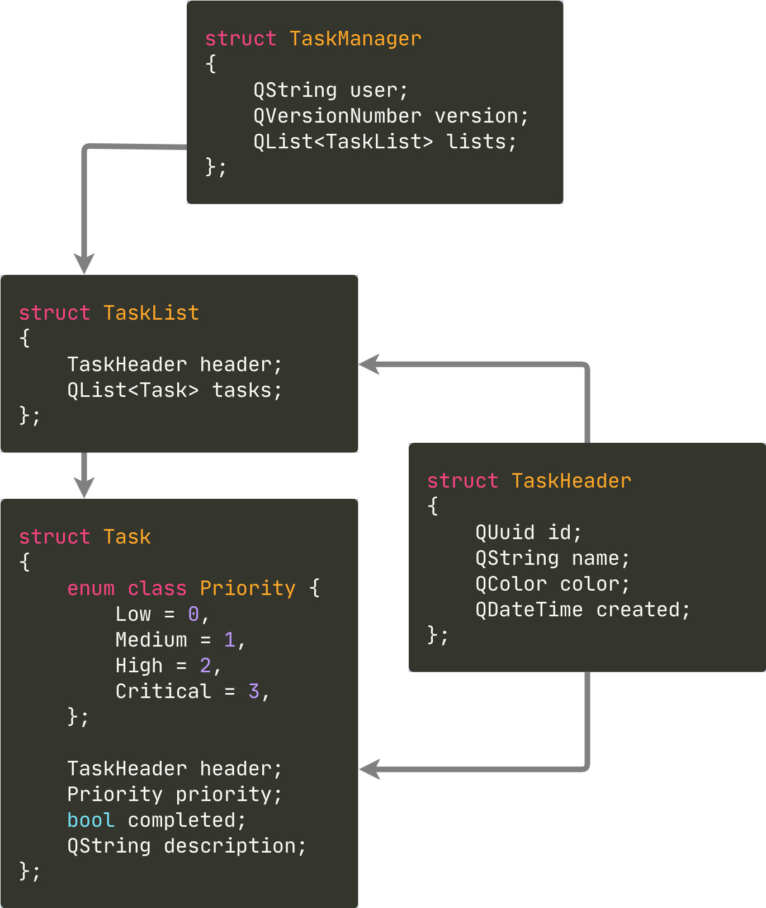

# Qt Serialization Benchmarks

  

Benchmarks of Qt serialization formats using a `TaskManager` with **10,000 tasks**
(Qt 6.10.0, macOS ARM64)

| Format        | Serialization Time | Deserialization Time | Serialized Size |
|---------------|--------------------|----------------------|-----------------|
| QDataStream   | 0.50 ms            | 1 ms                 | 1127 KB         |
| XML           | 6.5 ms             | 7.5 ms               | 1757 KB         |
| JSON          | 14 ms              | 6 ms                 | 2005 KB         |
| CBOR          | 10 ms              | 6.7 ms               | 1691 KB         |
| QtProtobuf    | 10 ms              | 7.7 ms               | 890 KB          |

